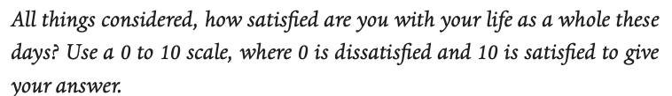

.. DO NOT EDIT.
.. THIS FILE WAS AUTOMATICALLY GENERATED BY SPHINX-GALLERY.
.. TO MAKE CHANGES, EDIT THE SOURCE PYTHON FILE:
.. "gallery/lesson1/plot_howtobehappy.py"
.. LINE NUMBERS ARE GIVEN BELOW.

.. only:: html

    .. note::
        :class: sphx-glr-download-link-note

        :ref:`Go to the end <sphx_glr_download_gallery_lesson1_plot_howtobehappy.py>`
        to download the full example code.

.. rst-class:: sphx-glr-example-title

.. _sphx_glr_gallery_lesson1_plot_howtobehappy.py:

.. _happyworld:

What you will learn
===================

[VIDEO HERE]

The problem
-----------

Every year since 2005, the `World Happiness Report <https://worldhappiness.report/ed/2018/>`_ 
has analysed the results of the Gallup World Poll, 
which is carried out in 160 countries (covering 99% of the world’s population). 
The pollsters contact a random sample of people in each country and ask them over 
100 questions about their income, their health and their family. These questions include the 
following question about happiness:

People living in different countries give different answers. In the UK it is 6.94, making the UK 17th in the world for happiness. 
The top ranked country --- rather surprisingly given a national stereotype of people who are reserved and don’t express their 
feelings very much --- is Finland, with a score of 7.82. In general, Scandinavian and Northern European countries are 
ranked highest. The USA is 16th (0.03 points ahead of the UK). China, with a score of 5.59 and at 72nd place, is 
roughly in the middle of the table of the countries surveyed. Other mid-ranked countries include Montenegro, Ecuador, 
Vietnam and Russia. Further down the table, we find many African --- Uganda and Ethiopia placed 117th and 131st, 
respectively, Middle Eastern countries --- Iran is at 110 and Yemen at 132.  
The unhappiest country in the world in 2022 is Afghanistan, with an average happiness score of only 2.40.

The question is what makes people happy? One possible answer is that people are happier when they live longer. 
It is this relationship in data that we will explore in this lesson.

The methods
-----------

Here we will learn about plotting and looking for relationships in data;
fitting straight lines through data points; understanding the slope and intercept of the line 
as parameters in a mathematical model; and showing that the parameters are the best possible fit to the data. 
These are all key data science skills and also the first steps towards machine learning. Specifically,
we will find out more about a method known as linear regression.

Before we get to linear regression, we are going to go take detour into another part of mathematics: 
calculus. When you studied calculus at school or university, you probably didn't associate it with finding statsitical
relationships in data. But in machine learning, we are often interested in finding the minimum value of a function, and for that 
we need to go back to differentiation. Once we have done that, 
we will use differentiation to find the slope of a line which minimises the distances 
between points and a line through those points.

How to use this material
------------------------

This material is taught as part of a 6 hour learning session. Your Kujenga instructor will have booked 
a time for an in-person or online two hour session. This means you have two hours to work to do either side of the
session. Here is what you should do:

*Before coming to the class*: You should read through this page and get a feeling for the contents and watch the videos. 
At the section on differentiation, solve the paper and 
pencil exercise (If you get stuck look `here <https://www.bbc.co.uk/bitesize/guides/zyj77ty/revision/1>`_), but otherwise you should 
simply read through and try to understand what we are doing. Along the way, you should 
download the `data <https://github.com/AfricaEuropeCoreAI/Kujenga/blob/main/course/lessons/data/HappinessData.csv>`_ 
for the exercise. You will need to have a Python environment set up on your computer or access via Google Colab (see here for
info on how to set that up). Then you can download this page as a Jupyter notebook or as Python code by clicking the links at
the bottom of this page. Run the code and focus on understanding what it does up to and including section `Finding the best fit line`_. 

*During class*: Your teacher will start by going through the theory for `Finding the best fit line`_. 
Please ask them questions and actively engage! This is your chance to really understand what is going on.

*After class*: The section `Exercise: look for other predictors of happiness`_ gives the exercises you will need to hand in to
your teacher in order to pass the section. Ask your teacher how you should submit your work.
 
Differentiation
===============

Taking the derivative of a function is about finding an equation for the slope of the curve the function describes. 
When the derivative is zero, the slope is zero. For a recap on differentiation, 
`this page <https://www.bbc.co.uk/bitesize/guides/zyj77ty/revision/1>`_ provides a quick review. And here
is Blessing from Univeristy of Lagos, Nigeria to lead you through an example!

.. youtube:: dBCV_cYxZAg
    :width: 100% 
    :align: center 

    

In the example Blessing goes through she tries to find the value of :math:`m` 
which minimises the function :math:`(4-2m)^2`. To solve this problem, 
you can first multiply out the brackets to get

.. math::

(4-2m)^2 = 16 - 16m + 4m^2 

You can then take a derivative in order to calculate the slope of the function, to get

.. math::

    -16 + 8m

We then solve this equal to zero, because the function is a minimum when it has slope zero.

.. math::

    - 16 + 8m = 0 \Rightarrow 8m = 16 \Rightarrow m = 2

Problem solved. 

.. admonition:: Think yourself!
  
  Use the derivative to find the minimum of

  .. math::

      (9-3m)^2  

Note that we use the letter :math:`m` for the variable, while
most often in school we use the letter :math:`x` for the variable. In maths it really doesn't 
matter what letter you use, as long as you are consistent, but we will later use :math:`m` for the slope of a line, 
so we wanted to start using it already now.

If you can solve the problem above, you have the mathematics needed to work through the rest of this lesson.
But, irrespective of whether you can solve the problem above or not, we recommend you have a look at 
`Khan Academy's Calculus 1 course <https://www.khanacademy.org/math/calculus-1>`_. These calculus 
skills are part of the building blocks needed for the Kujenga course.
      
A line through the data
=======================

We already discussed looked at how the `World Happiness Report <https://worldhappiness.report/ed/2018/>`_ 
documents the happiness of people across the world. Now, let's load in that data to Python. In this video, 
David Sumpter steps through the code. Watch it first then try running the code yourself.

[VIDEO HERE]

.. GENERATED FROM PYTHON SOURCE LINES 138-158

.. code-block:: Python

    from IPython.display import display
    import pandas as pd
    import matplotlib.pyplot as plt
    import matplotlib
    import numpy as np

    # Read in the data, we shorten the variable names 
    happy = pd.read_csv("../data/HappinessData.csv",delimiter=';') 
    happy.rename(columns = {'Social support':'SocialSupport'}, inplace = True) 
    happy.rename(columns = {'Life Ladder': 'Happiness'}, inplace = True) 
    happy.rename(columns = {'Perceptions of corruption':'Corruption'}, inplace = True) 
    happy.rename(columns = {'Log GDP per capita': 'LogGDP'}, inplace = True) 
    happy.rename(columns = {'Healthy life expectancy at birth': 'LifeExp'}, inplace = True) 
    happy.rename(columns = {'Freedom to make life choices': 'Freedom'}, inplace = True) 

    # We just look at data for 2018 and dsiplay in table.
    df=happy.loc[happy['Year'] == 2018]
    display(df[['Country name','LifeExp','Happiness']])

.. rst-class:: sphx-glr-script-out

 .. code-block:: none

         Country name    LifeExp  Happiness
    10    Afghanistan  52.599998   2.694303
    21        Albania  68.699997   5.004403
    28        Algeria  65.900002   5.043086
    45      Argentina  68.800003   5.792797
    58        Armenia  66.900002   5.062449
    ...           ...        ...        ...
    1654    Venezuela  66.500000   5.005663
    1667      Vietnam  67.900002   5.295547
    1678        Yemen  56.700001   3.057514
    1690       Zambia  55.299999   4.041488
    1703     Zimbabwe  55.599998   3.616480

    [136 rows x 3 columns]

.. GENERATED FROM PYTHON SOURCE LINES 159-164

Creating the plot 
-----------------
The code below plots the average life expectancy of 
each of these countries against their happiness (life ladder) scores. 

.. GENERATED FROM PYTHON SOURCE LINES 165-192

.. code-block:: Python

    from pylab import rcParams
    rcParams['figure.figsize'] = 14/2.54, 14/2.54
    matplotlib.font_manager.FontProperties(family='Helvetica',size=11)

    def plotData(df,x,y): 
        fig,ax=plt.subplots(num=1)
        ax.plot(x,y, data=df, linestyle='none', markersize=5, marker='o', color=[0.85, 0.85, 0.85])
        for country in ['United States','United Kingdom','Croatia','Benin','Finland','Yemen']:
            ci=np.where(df['Country name']==country)[0][0]
            ax.plot(  df.iloc[ci][x],df.iloc[ci][y], linestyle='none', markersize=7, marker='o', color='black')
            ax.text(  df.iloc[ci][x]+0.5,df.iloc[ci][y]+0.08,  country)
           
        ax.set_xticks(np.arange(30,90,step=5))
        ax.set_yticks(np.arange(11,step=1))
        ax.set_ylabel('Average Happiness (0-10)')
        ax.set_xlabel('Life Expectancy at Birth')
        ax.spines['top'].set_visible(False)
        ax.spines['right'].set_visible(False)
        ax.set_xlim(47,78)
        ax.set_ylim(2.5,8.1) 
        return fig,ax

    fig,ax=plotData(df,'LifeExp','Happiness')

    plt.show()

.. image-sg:: /gallery/lesson1/images/sphx_glr_plot_howtobehappy_001.png
   :alt: plot howtobehappy
   :srcset: /gallery/lesson1/images/sphx_glr_plot_howtobehappy_001.png
   :class: sphx-glr-single-img

.. GENERATED FROM PYTHON SOURCE LINES 193-218

Each circle in the plot is a country. 
The x-axis shows the life expectancy in the country and 
the y-axis shows the average ranking of life satisfaction, 
on the 0 to 10 scale. In general, the higher the life expectancy of a country, 
the higher the happiness (life satisfaction) there. 

Drawing a line
--------------

One way to quantify this relationship is to draw a straight line
through the points, showing how happiness increases with life expectancy. 
For example, imagine that for every 12 extra years which people live in a 
country they are one point happier. The equation for happiness in this case 
would then look like this,

.. math::

   \mbox{Happiness} = \frac{\mbox{Life Expectancy}}{12}

in this case, if the average life expectancy in the country 
is 60 then the equation above predicts the happiness to be 60/12=5. 
If the life expectancy is 78 then average happiness is predicted to be 78/12=6.5. And so on...

We can draw this equation in the form of a straight line going 
through the cloud of country points, as shown below.

.. GENERATED FROM PYTHON SOURCE LINES 218-235

.. code-block:: Python

    # Setup parameters: m is the slope of the line
    # And calculate a line with that slope.

    m=1/12
    Life_Expectancy=np.arange(0.5,100,step=0.01)
    Happiness= m*Life_Expectancy

    # Plot the data and the line
    fig,ax=plotData(df,'LifeExp','Happiness')
    ax.plot(Life_Expectancy, Happiness, linestyle='-', color='black')
    df=df.assign(Predicted=np.array(m*df['LifeExp']))
    for country in ['United States','United Kingdom','Croatia','Benin','Finland','Yemen']:
        ci=np.where(df['Country name']==country)[0][0]
        ax.plot(  [df.iloc[ci]['LifeExp'],df.iloc[ci]['LifeExp']] ,[ df.iloc[ci]['Happiness'],df.iloc[ci]['Predicted']] ,linestyle=':', color='black')
    plt.show()

.. image-sg:: /gallery/lesson1/images/sphx_glr_plot_howtobehappy_002.png
   :alt: plot howtobehappy
   :srcset: /gallery/lesson1/images/sphx_glr_plot_howtobehappy_002.png
   :class: sphx-glr-single-img

.. GENERATED FROM PYTHON SOURCE LINES 236-265

.. admonition:: Try it yourself!

  Download the code by clicking on the link below and 
  try changing the slope and the intercept of the line above by 
  changing the values 1/12 and replotting the line.
  See if you can find a line that lies closer to the data points.

The sum of squares
------------------

Each of the dotted lines above show how far the line – which predicts that happiness is one 
twelfth of life expectancy – is from the data for each of the six highlighted countries.
For example, the USA has a happiness score of 6.88 and an 
average life expectancy of 68.3. The first equation (figure 2b) predicts 

.. math::

   \mbox{Predicted USA Happiness} = \frac{\mbox{USA Life Expectancy}}{12} = \frac{\mbox{68.3}}{12} =  5.69

Which means that the squared distance between the prediction and reality is 

.. math::

 (6.88 - 5.69)^2 = 1.412

The table below shows the predicted value and the squared distance between 
prediction and reality for each country. We then sum these squared distances 
to get an overall measure of how far our predictions our from reality. This is done below.

.. GENERATED FROM PYTHON SOURCE LINES 265-274

.. code-block:: Python

    df=df.assign(SquaredDistance=np.power((df['Predicted'] - df['Happiness']),2))
    display(df[['Country name','Happiness','Predicted','SquaredDistance']])
             
    Model_Sum_Of_Squares = np.sum(df['SquaredDistance'])

    print('The model sum of squares is %.4f' % Model_Sum_Of_Squares)

.. rst-class:: sphx-glr-script-out

 .. code-block:: none

         Country name  Happiness  Predicted  SquaredDistance
    10    Afghanistan   2.694303   4.383333         2.852822
    21        Albania   5.004403   5.725000         0.519260
    28        Algeria   5.043086   5.491667         0.201225
    45      Argentina   5.792797   5.733334         0.003536
    58        Armenia   5.062449   5.575000         0.262709
    ...           ...        ...        ...              ...
    1654    Venezuela   5.005663   5.541667         0.287300
    1667      Vietnam   5.295547   5.658333         0.131614
    1678        Yemen   3.057514   4.725000         2.780510
    1690       Zambia   4.041488   4.608333         0.321313
    1703     Zimbabwe   3.616480   4.633333         1.033991

    [136 rows x 4 columns]
    The model sum of squares is 82.8467

.. GENERATED FROM PYTHON SOURCE LINES 275-373

Finding the best fit line 
=========================
We have drawn a line. But the question is what the ‘best’ line is? Blessing goes through the theory 
below and then we will calculate the best fitting line for the data above.

.. youtube:: 1dsTGNywCjc
   :width: 100% 
   :align: center 

Sum of squares
--------------

Let’s start by formulating this problem mathematically. 
For each country :math:`i`, 
we have two values: the life satisfaction, which I will call :math:`y_i` 
and life expectancy, which I will call :math:`x_i` . For example, 
when :math:`i=`USA then :math:`x_i=6.88` and :math:`y_i=68.3`. 

Now, let’s denote the slope of the line as :math:`m` (in the plot above
:math:`m=1/12`) and repeat the caluclation we made above but with letters instead 
of numbers. First we note that 

.. math::

 \hat{y_i} = m \cdot x_i = 1/12 \cdot 6.88

The little "hat" in :math:`\hat{y_i}` denotes that it is a prediction 
(rather than the measured value itself, which is :math:`y_i`). 
The squared distance between the prediction and outcome is written as

.. math::

 ( y_i - m \cdot x_i)^2 

I want to emphasise here that all I am doing is rewriting the same calculation I
did above with numbers, but now with the letters. The reason for doing this is that 
our aim is to find an equation for the value of :math:`m` which minimises the sum of square 
distances.

The next step is to write out the sum

.. math::

 ( y_1 - m \cdot x_1)^2 +  ( y_2 - m \cdot x_2)^2  + ... + ( y_{136} - m \cdot x_{136})^2  

The above equation is can be written in shorthand form (using the sum notation we met 
in :ref:`the section on our average friend <averagefriends>` as

.. math::

 \sum_i^n ( y_i - m \cdot x_i)^2 

where :math:`n=136` is the number of countries. 

Back to differentiation
-----------------------

We want to find the value of :math:`m` which minimises this sum of squares. But how do we do this? 

The answer is differentiation. We now want to find the value of :math:`m` which minimises the sum of squares. 
The equation above is more complicated than the one we used in the section on `Differentiation`_.

Although  the algebra is more complicated, we can use exactly the same logic to solve the problem 
above, of finding the value of :math:`m` which minimises this sum of squares. We first
take the derivative 

.. math::

 \frac{d}{dm} \left( ( y_1 - m \cdot x_1)^2 +  ( y_2 - m \cdot x_2)^2  + ... + ( y_{136} - m \cdot x_{136})^2  \right)

 = - 2 x_1 y_1 + 2 x_1^2 m  - 2 x_2 y_2 + 2 x_2^2 m  +  ... - 2 x_{136} y_{136} + 2 x_{136}^2 m  

Although this particular step involves alot of algebra, notice that we are doing exactly the same as in the example above.
Another thing that I find can confuse students (when I teach this in statistics) is that 
we differentiate with respect to :math:`m`. 
In school, we often use the letter :math:`x` for the variable name and :math:`m` for a constant. Here it is the other way round. 
The data :math:`x_i` and :math:`y_i` are constants (measurements from countries) and  :math:`m` is the variable we differentiate for.

We now write the sum above in shorthand as

.. math::

 \sum_i^n 2 x_i y_i - \sum_i^n 2 \cdot x_i^2 m

and we solve equal to zero (to find the point at which it is minimized, and the slope is zero) to get

.. math::

 \sum_i^n 2 x_i y_i - \sum_i^n 2 \cdot x_i)^2 m = 0 \Rightarrow \sum_i^n 2 x_i y_i = \sum_i^n 2 \cdot x_i^2 m \Rightarrow \sum_i^n x_i y_i = \sum_i^n x_i^2

Moving the :math:`m` to the left hand side gives

.. math::

 m = \frac{\sum_i^n x_i y_i}{\sum_i^n x_i^2}

Let's use our newly found equation to calculate the line that best fits the data.

.. GENERATED FROM PYTHON SOURCE LINES 373-380

.. code-block:: Python

    df=df.assign(SquaredLifEExp=np.power(df['LifeExp'],2))
    df=df.assign(HappinessLifEExp=df['LifeExp'] * df['Happiness'])

    m_best = np.sum(df['HappinessLifEExp'])/np.sum(df['SquaredLifEExp'])
    print('The best fitting line has slope m = %.4f' % m_best)

.. rst-class:: sphx-glr-script-out

 .. code-block:: none

    The best fitting line has slope m = 0.0856

.. GENERATED FROM PYTHON SOURCE LINES 381-385

Our intial guess of :math:`m = 1/12 = 0.0833` wasn't so far away from the best fitting value. 
But this new slope is slightly closer to the data. We can now plot this and recalculate 
the model sum of squares

.. GENERATED FROM PYTHON SOURCE LINES 385-403

.. code-block:: Python

    Life_Expectancy=np.arange(0.5,100,step=0.01)
    Happiness= m_best*Life_Expectancy

    fig,ax=plotData(df,'LifeExp','Happiness')
    ax.plot(Life_Expectancy, Happiness, linestyle='-', color='black')
    df=df.assign(Predicted=np.array(m_best*df['LifeExp']))
    for country in ['United States','United Kingdom','Croatia','Benin','Finland','Yemen']:
        ci=np.where(df['Country name']==country)[0][0]
        ax.plot(  [df.iloc[ci]['LifeExp'],df.iloc[ci]['LifeExp']] ,[ df.iloc[ci]['Happiness'],df.iloc[ci]['Predicted']] ,linestyle=':', color='black')
 
    plt.show()

    df=df.assign(SquaredDistance=np.power((df['Predicted'] - df['Happiness']),2))
             
    Model_Sum_Of_Squares = np.sum(df['SquaredDistance'])             
    print('The model sum of squares is %.4f' % Model_Sum_Of_Squares)

.. image-sg:: /gallery/lesson1/images/sphx_glr_plot_howtobehappy_003.png
   :alt: plot howtobehappy
   :srcset: /gallery/lesson1/images/sphx_glr_plot_howtobehappy_003.png
   :class: sphx-glr-single-img

.. rst-class:: sphx-glr-script-out

 .. code-block:: none

    The model sum of squares is 79.9469

.. GENERATED FROM PYTHON SOURCE LINES 404-424

Again, this sum of squares is slightly smaller than the value we got above 
for :math:`m = 1/12` 

Including the Intercept
-----------------------
An equation for a straight line usually has two components a slope :math:`m`
which we have already seen and an intercept :math:`k`, which so far we have assumed is zero.
We can write the equation for a straight line as

.. math::

 y = k + m \times x

We now look at how we can improve the fit of the model by
including this intercept.

We start by shifting the data so that it has a mean (average) of zero.
To do this we simply take away the mean value from both life expectancy and 
from happiness. Then replot the data 

.. GENERATED FROM PYTHON SOURCE LINES 424-437

.. code-block:: Python

    df=df.assign(ShiftedLifeExp=df['LifeExp'] - np.mean(df['LifeExp']))
    df=df.assign(ShiftedHappiness=df['Happiness'] - np.mean(df['Happiness']))

    fig,ax=plotData(df,'ShiftedLifeExp','ShiftedHappiness')
    ax.set_ylabel('Happiness (corrected for Mean Happiness)')
    ax.set_xlabel('Life Expectancy (corrected for Mean Life Expectancy) ')
    ax.set_xticks(np.arange(-30,30,step=5))
    ax.set_yticks(np.arange(-5,5,step=1))
    ax.set_xlim(-20,15)
    ax.set_ylim(-3,3) 
    plt.show()

.. image-sg:: /gallery/lesson1/images/sphx_glr_plot_howtobehappy_004.png
   :alt: plot howtobehappy
   :srcset: /gallery/lesson1/images/sphx_glr_plot_howtobehappy_004.png
   :class: sphx-glr-single-img

.. GENERATED FROM PYTHON SOURCE LINES 438-448

This graph shows us that, for example, Yemen is almost -2.5 points below the world 
average for happiness and has a life expectency 8 years shorter than the average over
all countries in the world. The United States life expectancy is around 3.5 years longer than 
the average and the citizens of the USA are about 1.3 points happier than average.
It is worth noting that the correction is for country averages and does not account for the size of the 
populations of these various countries. It does however give us a new way 
of seeing between country differences.

Let's now try to find the best fit line which goes through these data points.

.. GENERATED FROM PYTHON SOURCE LINES 448-469

.. code-block:: Python

    df=df.assign(SquaredLifEExp=np.power(df['ShiftedLifeExp'],2))
    df=df.assign(HappinessLifEExp=df['ShiftedLifeExp'] * df['ShiftedHappiness'])

    m_best = np.sum(df['HappinessLifEExp'])/np.sum(df['SquaredLifEExp'])
    print('The best fitting line has slope m = %.4f' % m_best)

    Life_Expectancy=np.arange(-50,50,step=0.01)
    Happiness= m_best*Life_Expectancy

    fig,ax=plotData(df,'ShiftedLifeExp','ShiftedHappiness')
    ax.plot(Life_Expectancy, Happiness, linestyle='-', color='black')
    ax.set_ylabel('Happiness (corrected for Mean Happiness)')
    ax.set_xlabel('Life Expectancy (corrected for Mean Life Expectancy) ')
    ax.set_xticks(np.arange(-30,30,step=5))
    ax.set_yticks(np.arange(-5,5,step=1))
    ax.set_xlim(-20,15)
    ax.set_ylim(-3,3) 

    plt.show()

.. image-sg:: /gallery/lesson1/images/sphx_glr_plot_howtobehappy_005.png
   :alt: plot howtobehappy
   :srcset: /gallery/lesson1/images/sphx_glr_plot_howtobehappy_005.png
   :class: sphx-glr-single-img

.. rst-class:: sphx-glr-script-out

 .. code-block:: none

    The best fitting line has slope m = 0.1226

.. GENERATED FROM PYTHON SOURCE LINES 470-474

This line appears to fit better than the one we fitted earlier! It lies 
closer to the points and better capture the relationship in the data.
To test whether this is indeed the case we can calculate the sum of squares
between this new line and the shifted data. This is as follows

.. GENERATED FROM PYTHON SOURCE LINES 474-481

.. code-block:: Python

    df=df.assign(Predicted=np.array(m_best*df['ShiftedLifeExp']))       
    df=df.assign(SquaredDistance=np.power((df['Predicted'] - df['ShiftedHappiness']),2))
            
    Model_Sum_Of_Squares = np.sum(df['SquaredDistance'])             
    print('The model sum of squares is %.4f' % Model_Sum_Of_Squares)

.. rst-class:: sphx-glr-script-out

 .. code-block:: none

    The model sum of squares is 71.7665

.. GENERATED FROM PYTHON SOURCE LINES 482-511

This new line through the data is better! It has a smaller sum of squares. 

The mean values are calculated as follows

.. math::

 \bar{x} = \frac{1}{n} \sum_i^n x_i \mbox{ and }  \bar{y} = \frac{1}{n} \sum_i^n y_i 

Using this notation, the equation for the line through the data is

.. math::

 \hat{y_i} - \bar{y} = m  (\hat{x_i} - \bar{x})

Just to remind you about the notation. The predicted value has a hat over it, while the mean values
have a bar over them. We can rearrange this equation to get 

.. math::

 \hat{y_i}  = m \hat{x_i} + (\bar{y} - m\bar{x})

Notice that this is an equation for a straight line, so we can write

.. math::

 \hat{y_i}  = m \hat{x_i} + k  \mbox{ where } k = \bar{y} - m\bar{x}

Let's apply this to data and plot the line again

.. GENERATED FROM PYTHON SOURCE LINES 511-534

.. code-block:: Python

    k_best = np.mean(df['Happiness']) - m_best*np.mean(df['LifeExp'])

    Life_Expectancy=np.arange(0.5,100,step=0.01)
    Happiness= m_best*Life_Expectancy + k_best

    fig,ax=plotData(df,'LifeExp','Happiness')
    ax.plot(Life_Expectancy, Happiness, linestyle='-', color='black')
    df=df.assign(Predicted=np.array(m_best*df['LifeExp']+k_best))
    for country in ['United States','United Kingdom','Croatia','Benin','Finland','Yemen']:
        ci=np.where(df['Country name']==country)[0][0]
        ax.plot(  [df.iloc[ci]['LifeExp'],df.iloc[ci]['LifeExp']] ,[ df.iloc[ci]['Happiness'],df.iloc[ci]['Predicted']] ,linestyle=':', color='black')
 
    plt.show()

    print('The slope of the line is m = %.4f and the intercept is k = %.4f' % (m_best,k_best))
    print('An increase in life expectancy of %.4f years is associated with one extra point of happiness' % (1/m_best))
   
    df=df.assign(SquaredDistance=np.power((df['Predicted'] - df['Happiness']),2))          
    Model_Sum_Of_Squares = np.sum(df['SquaredDistance'])             

    print('The model sum of squares is still %.4f' % Model_Sum_Of_Squares)

.. image-sg:: /gallery/lesson1/images/sphx_glr_plot_howtobehappy_006.png
   :alt: plot howtobehappy
   :srcset: /gallery/lesson1/images/sphx_glr_plot_howtobehappy_006.png
   :class: sphx-glr-single-img

.. rst-class:: sphx-glr-script-out

 .. code-block:: none

    The slope of the line is m = 0.1226 and the intercept is k = -2.4252
    An increase in life expectancy of 8.1580 years is associated with one extra point of happiness
    The model sum of squares is still 71.7665

.. GENERATED FROM PYTHON SOURCE LINES 535-538

Now we have it. By shifting back to the original co-ordinates we
can find the best fitting line through the data. Notice that the sum of squares is unaffected by
shifting the line back again, since the distances from the points to the line are unaffected. 

.. GENERATED FROM PYTHON SOURCE LINES 540-562

Verifying our analytical solution with Statsmodels
--------------------------------------------------

So, we’ve just done all the math by hand,pretty satisfying, right?
But now the big question is... could there be an easier way?
Maybe there’s a Python library that just does all the heavy lifting for us?

Yep — that’s where `statsmodels` comes in. It basically runs the same linear regression
we just worked out by hand, but behind the scenes. This is exactly how a Machine
Learning Engineer would handle it in practice — less manual math, more letting Python
do the work.

What we’re doing here is just checking: does `statsmodels` give us the same m and k
If they do, that means our manual derivation was spot on!

Let’s test it out — and Victoria from Kenya will walk you through the code.

*N.B.* Make sure you have `statsmodels` installed in your Python environment:
   pip install statsmodels  or if you are using **conda**:
   conda install statsmodels

[VIDEO HERE]

.. GENERATED FROM PYTHON SOURCE LINES 562-580

.. code-block:: Python

    # Import the Ordinary Least Squares (OLS) regression tool from statsmodels
    # "ols" stands for Ordinary Least Squares – the most common method for fitting a line.
    from statsmodels.formula.api import ols

    # Fit a linear regression model using statsmodels.
    # The formula 'Happiness ~ LifeExp' means:
    # "predict Happiness using LifeExp as the independent variable".
    model = ols('Happiness ~ LifeExp', data=df).fit()

    # Display the model parameters:
    # Intercept corresponds to 'k', and the coefficient for LifeExp corresponds to 'm'.
    print("\nStatsmodels estimated parameters (Intercept and LifeExp):")
    print(model.params)

.. rst-class:: sphx-glr-script-out

 .. code-block:: none

    Statsmodels estimated parameters (Intercept and LifeExp):
    Intercept   -2.416310
    LifeExp      0.122579
    dtype: float64

.. GENERATED FROM PYTHON SOURCE LINES 581-605

We can say (roughly speaking) that for every 8 years of life expectancy
country citizens are about 1 point happier on a scale of 0 to 10. It isn't 
the whole truth (see the word of warning below), but it isn't entirely misleading either. 

Interpretting the data
======================

Although there is a relationship between these two variables, this does not mean
that life expectancy causes happiness.

The dangers on confusing correlation for causation.....

Exercise: look for other predictors of happiness
===============================================

Find best predictor using sum of squares
Give one argument why it causes happiness.
Give one argument why it might be correlated with but does not cause happiness.
Advanced add 

.. GENERATED FROM PYTHON SOURCE LINES 606-615

.. code-block:: Python

    # Using regression in applications
    # ================================
    # 
    #
    #
    # Need to write about independent and dependent variables. A bit about each applications

.. rst-class:: sphx-glr-timing

   **Total running time of the script:** (0 minutes 5.481 seconds)

.. _sphx_glr_download_gallery_lesson1_plot_howtobehappy.py:

.. only:: html

  .. container:: sphx-glr-footer sphx-glr-footer-example

    .. container:: sphx-glr-download sphx-glr-download-jupyter

      :download:`Download Jupyter notebook: plot_howtobehappy.ipynb <plot_howtobehappy.ipynb>`

    .. container:: sphx-glr-download sphx-glr-download-python

      :download:`Download Python source code: plot_howtobehappy.py <plot_howtobehappy.py>`

    .. container:: sphx-glr-download sphx-glr-download-zip

      :download:`Download zipped: plot_howtobehappy.zip <plot_howtobehappy.zip>`

.. only:: html

 .. rst-class:: sphx-glr-signature

    `Gallery generated by Sphinx-Gallery <https://sphinx-gallery.github.io>`_
