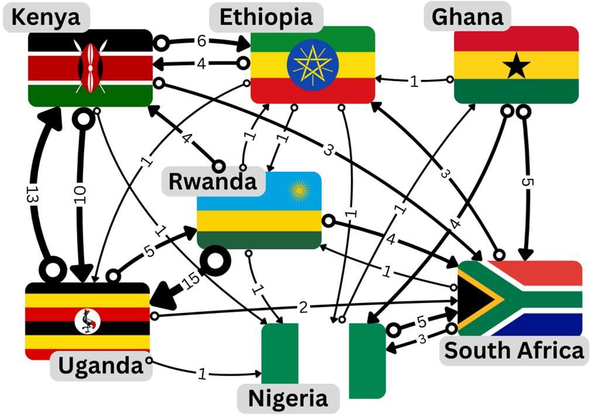

.. DO NOT EDIT.
.. THIS FILE WAS AUTOMATICALLY GENERATED BY SPHINX-GALLERY.
.. TO MAKE CHANGES, EDIT THE SOURCE PYTHON FILE:
.. "gallery/lesson4/plot_influencer.py"
.. LINE NUMBERS ARE GIVEN BELOW.

.. only:: html

    .. note::
        :class: sphx-glr-download-link-note

        :ref:`Go to the end <sphx_glr_download_gallery_lesson4_plot_influencer.py>`
        to download the full example code.

.. rst-class:: sphx-glr-example-title

.. _sphx_glr_gallery_lesson4_plot_influencer.py:

.. _google:

What you will learn
===================

How important is a webpage on the internet? This was the question that Google founders Larry Page and Sergey Brin asked themselves when they were developing their search engine. In this lesson we will learn the maths behind the solution, now known as PageRank, which is the basis of the algorithm that powers Google search.

As Otema explains in the video below the PageRank algorithm is the additional ingredient that allows search engines to rank the most relevant pages first. The PageRank algorithm is based on the idea that a page is important if it is linked to other important pages. Although it was originally intended to rank web pages, the PageRank algorithm can be used to analyze any kind of network, for example, social connections, biological systems and transportation infrastructure to name a few.

.. youtube:: D8OxGNeXNIY
    :width: 100%
    :align: center

|

The problem
-----------

In this lesson we will work with a small network built from Wikipedia pages of `Ethiopia <https://en.wikipedia.org/wiki/Ethiopia>`_, `Ghana <https://en.wikipedia.org/wiki/Ghana>`_, `Kenya <https://en.wikipedia.org/wiki/Kenya>`_, `Nigeria <https://en.wikipedia.org/wiki/Nigeria>`_, `Rwanda <https://en.wikipedia.org/wiki/Rwanda>`_, `South Africa <https://en.wikipedia.org/wiki/South Africa>`_ and `Uganda <https://en.wikipedia.org/wiki/Uganda>`_ -- chosen for being the home countries of the African members of the Kujenga team. These pages represent a tiny part of the internet but the principles we will learn can be applied to networks of any size. See the video below where Amy introduces our tiny internet.

.. youtube:: HO-I-6vHEY4
    :width: 100%
    :align: center
|
We represent our network of Wikipedia pages as a directed graph where each node represents a country, shown as labeled country flags in the video. In order to construct the connections between nodes in the graph we check on each country's page for links to the other 6 countries. For example, in the first paragraph of the page for `Ethiopia <https://en.wikipedia.org/wiki/Ethiopia>`_ we read:

*Ethiopia, officially the Federal Democratic Republic of Ethiopia, is a landlocked country located in the Horn of Africa region of East Africa. It shares borders with Eritrea to the north, Djibouti to the northeast, Somalia to the east,* `Kenya <https://en.wikipedia.org/wiki/Kenya>`_ *to the south, South Sudan to the west, and Sudan to the northwest.*

Here we see a link to Kenya, meaning we should count this as a connection from Ethiopia to Kenya. We represent this connection as a directed edge in the graph, shown by an arrow pointing from Ethiopia to Kenya. The weight of each edge, shown as a number next to the edge, counts the total number of links from page *A* to page *B*, in this case, there are a total of 4 links from from Ethiopia's page to Kenya's.

.. note::
    Wikipedia is a dynamic website and the links between pages can change over time, the network we are using is a snapshot of the Wikipedia pages taken in November 2024. You may want to update this network or even add your home country if is not already included.

.. admonition:: Food for Thought
    :class: food-for-thought

    As Amy mentions in the video, use your intuitive understanding of the problem to predict which countries' pages you think will have a high (or low) ranking.

The methods
-----------------

We have seen a graphical representation of a network in `The problem`_ but in order to use the PageRank algorithm we will need to represent the network mathematically as a matrix. In the following section, we will learn how to work with matrices as well as some basic concepts of linear algebra. The most useful concepts for understanding PageRank will be the notions of an eigenvector and eigenvalue of a matrix which we cover in `Defining a matrix`_.

How to use this material
------------------------

This material is taught as part of a 6-hour learning session. Your Kujenga instructor will have booked
a time for an in-person or online 2-hour session. This means you have two hours of work to do on either side of the in-person or online
session. Here is what you should do:

*Before coming to the class*: You should read through this entire page. In the section on `<LINK NEEDED>`_,
try to solve the example both by hand and using Python. If you get stuck look `here <LINK NEEDED>`_, but otherwise you should
simply read through and try to understand what we are doing. Once you have read through, you should
download this page as a Jupyter notebook or as Python code by clicking the links at the bottom of this page.
You will need to have a Python environment set up on your computer or access via Google Colab (see here for info on how to set that up).

*During class*: Your teacher will start by going through the theory for `<LINK NEEDED>`_.
Please ask them questions and actively engage!

.. GENERATED FROM PYTHON SOURCE LINES 69-162

The Mathematics of the PageRank algorithm
=====================
The PageRank algorithm can be understood as modeling the behavior of a "random surfer" navigating the internet. This surfer either clicks on a link on the current page or occasionally gets bored and jumps to a completely random page. The PageRank score of a page represents the long-term probability that this random surfer will end up on that particular page.

Preliminaries
----------------------

Let's break down the process using some mathematical formulas.

The PageRank Vector (\ :strong:`R`)

.. math::
    \mathbf{R} = \begin{pmatrix} r_1 \\ r_2 \\ \vdots \\ r_N \end{pmatrix}
This vector \ :strong:`R` represents the PageRank scores for all N=7 pages in the graph.
Each element r\ :sub:`i` is the PageRank score of page i.
Initially, these scores can be set equally, for example, r\ :sub:`i` = 1/N for all i.

The Transition Matrix (\ :strong:`M`)

.. math::
    M_{ij} = \begin{cases} 1/L_j^{\text{out}}, & \text{if } j \text{ links to } i \\ 0, & \text{otherwise} \end{cases}
This matrix \ :strong:`M` (often called the hyperlink matrix or transition matrix) encodes the link structure of the network.

* L\ :sub:`j`\ :sup:`out` is the total number of outgoing links from page j.
* \ :strong:`M`\ :sub:`ij` represents the probability of transitioning from page j to page i by following some specific link.

  * If page j links to page i, the probability of following a specific link from j to i is 1/L\ :sub:`j`\ :sup:`out` , assuming the surfer chooses randomly among all outgoing links.
  * If there is no link from j to i, then \ :strong:`M`\ :sub:`ij` = 0.

The Iterative Update Rule
----------------------

.. math::
    \mathbf{R}(t + 1) = d\mathbf{M}\mathbf{R}(t) + \frac{1-d}{N} \mathbf{1}
This is the core formula for calculating PageRank iteratively.

* \ :strong:`R`\ (t) is the PageRank vector at iteration t, and \ :strong:`R`\ (t+1) is the vector at the next iteration.
* d is the "damping factor" (typically around 0.85). It represents the probability that the random surfer will continue following links (as opposed to jumping to a random page). In practice, this is important to handle "dangling nodes", nodes with no outgoing links L\ :sub:`j`\ :sup:`out` = 0.

\ :strong:`M`\ \ :strong:`R`\ (t) calculates how the existing PageRank scores \ :strong:`R`\ (t) are distributed across the network by following links. Element i of this resulting vector is the sum of PageRank contributions from all pages j that link to page i.
d\ \ :strong:`M`\ \ :strong:`R`\ (t) is the portion of the PageRank score derived from surfers following links.

1-d is the probability that the surfer gets bored and jumps to a random page.
(1-d)/N is the probability of landing on any specific page during a random jump (assuming N pages total).
**1** is a column vector of size N containing all ones.
(1-d)/N **1** represents the PageRank score distributed equally among all pages due to the random jump behavior. This term ensures that all pages receive some minimal rank and helps the algorithm converge. This is especially important for dealing with nodes with no outgoing links L\ :sub:`j`\ :sup:`out` = 0, as mentioned earlier, or disconnected parts of the graph.

Convergence
----------------------

.. math::
    \mathbf{R}(t + 1) \approx \mathbf{R}(t)
The iterative update process is repeated until the PageRank vector **R** stabilizes.
Convergence is reached when the difference between the PageRank vector in the current iteration **R**\ (t+1) and the previous iteration **R**\ (t) is very small (below some predefined threshold).
The final vector **R** represents the stable probability distribution of the random surfer, indicating the relative importance of each page.

Simplified update rule for connected graphs
----------------------

Looking at the graph representing our network of Wikipedia pages we can see that the graph is connected, a technical term meaning there is a path between every pair of distinct nodes ignoring the direction of the edges. It is clear that we do not need to take into account any "dangling nodes", nodes with no outgoing links L\ :sub:`j`\ :sup:`out` = 0,  or disconnected parts of the graph.

Using this observation we can simplify the update rule by setting d = 1. This means that the random surfer will always follow a link and never jump to a random page. The update rule becomes:

.. math::
    \mathbf{R}(t + 1) = \frac{1}{\lambda} \mathbf{M}\mathbf{R}(t)
Here we introduce a normalization factor :math:`\lambda`. This normalization ensures that all PageRank scores (element of the vector **R**) sum to a constant value.

Assuming the algorithm has converged, **R**\ (t + 1) = **R**\ (t), you might already recognize the resemblance to the eigenvalue equation:

.. math::
    \mathbf{M}\mathbf{R} = \lambda \mathbf{R}
If not don't worry, we will cover the details in the section `Eigenvalues and eigenvectors of a matrix`_.

In the video below Amy discusses the theory above and shows the results of applying the simplified update rule iteratively. You will see how to implement this yourself in the section ``_.

.. youtube:: guf36O9rBXs
    :width: 100%
    :align: center
|
.. admonition:: Food for Thought
    :class: food-for-thought

    It turned out that Nigeria had the highest PageRank and Kenya and Uganda the lowest. Did this match your expectations based on the network shown in section `The problem`_.

Working with matrices in Python
=====================

NumPy (Numerical Python) is the fundamental package for scientific computing in Python. It provides a powerful N-dimensional array object and tools for working with these arrays. We'll use NumPy arrays to represent vectors (1D arrays) and matrices (2D arrays).

Importing NumPy
-----------------
NumPy is a third-party library, so you need to install it separately. If you are using Google Colab, it is already included.
To load NumPy with the alias np, you can use the following command:

.. GENERATED FROM PYTHON SOURCE LINES 162-165

.. code-block:: Python

    import numpy as np

.. GENERATED FROM PYTHON SOURCE LINES 166-170

Defining a vector (1D Arrays)
-----------------

A vector can be thought of as a list of numbers. In NumPy, you create it using np.array() with a Python list:

.. GENERATED FROM PYTHON SOURCE LINES 170-176

.. code-block:: Python

    my_list = [1, 2, 3]
    my_vector = np.array(my_list)

    print("My Vector:")
    print(my_vector)

.. rst-class:: sphx-glr-script-out

 .. code-block:: none

    My Vector:
    [1 2 3]

.. GENERATED FROM PYTHON SOURCE LINES 177-179

Check its shape (dimensions)
Output: (3,) indicates a 1D array with 3 elements

.. GENERATED FROM PYTHON SOURCE LINES 179-181

.. code-block:: Python

    print("Vector shape:", my_vector.shape)

.. rst-class:: sphx-glr-script-out

 .. code-block:: none

    Vector shape: (3,)

.. GENERATED FROM PYTHON SOURCE LINES 182-186

Creating Matrices (2D Arrays)
-----------------

A matrix is like a grid of numbers (rows and columns). You create it using np.array() with a list of lists, where each inner list is a row:

.. GENERATED FROM PYTHON SOURCE LINES 186-192

.. code-block:: Python

    my_lists = [[1, 2, 3], [4, 5, 6]]
    my_matrix = np.array(my_lists)

    print("\nMy Matrix:")
    print(my_matrix)

.. rst-class:: sphx-glr-script-out

 .. code-block:: none

    My Matrix:
    [[1 2 3]
     [4 5 6]]

.. GENERATED FROM PYTHON SOURCE LINES 193-195

Check its shape (rows, columns)
Output: (2, 3) indicates 2 rows and 3 columns

.. GENERATED FROM PYTHON SOURCE LINES 195-197

.. code-block:: Python

    print("Matrix shape:", my_matrix.shape)

.. rst-class:: sphx-glr-script-out

 .. code-block:: none

    Matrix shape: (2, 3)

.. GENERATED FROM PYTHON SOURCE LINES 198-199

Create a square matrix (same number of rows and columns)

.. GENERATED FROM PYTHON SOURCE LINES 199-204

.. code-block:: Python

    square_matrix = np.array([[9, 8], [7, 6]])
    print("\nSquare Matrix:")
    print(square_matrix)
    print("Square Matrix shape:", square_matrix.shape)

.. rst-class:: sphx-glr-script-out

 .. code-block:: none

    Square Matrix:
    [[9 8]
     [7 6]]
    Square Matrix shape: (2, 2)

.. GENERATED FROM PYTHON SOURCE LINES 205-210

Basic Operations
-----------------

NumPy makes operating on vectors and matrices straightforward.
Element-wise Operations: Standard arithmetic operators (+, -, *, /) often work element-by-element if the shapes are compatible.

.. GENERATED FROM PYTHON SOURCE LINES 210-215

.. code-block:: Python

    vec1 = np.array([1, 2, 3])
    vec2 = np.array([4, 5, 6])
    mat1 = np.array([[1, 1], [2, 2]])
    mat2 = np.array([[3, 3], [4, 4]])

.. GENERATED FROM PYTHON SOURCE LINES 216-217

Vector addition (element-wise)

.. GENERATED FROM PYTHON SOURCE LINES 217-219

.. code-block:: Python

    print("\nVector Addition:", vec1 + vec2)  # Output: [5 7 9]

.. rst-class:: sphx-glr-script-out

 .. code-block:: none

    Vector Addition: [5 7 9]

.. GENERATED FROM PYTHON SOURCE LINES 220-221

Matrix addition (element-wise)

.. GENERATED FROM PYTHON SOURCE LINES 221-223

.. code-block:: Python

    print("Matrix Addition:\n", mat1 + mat2)

.. rst-class:: sphx-glr-script-out

 .. code-block:: none

    Matrix Addition:
     [[4 4]
     [6 6]]

.. GENERATED FROM PYTHON SOURCE LINES 224-225

Scalar multiplication (multiply every element by a number)

.. GENERATED FROM PYTHON SOURCE LINES 225-228

.. code-block:: Python

    print("Scalar Multiplication (Vector):", 3 * vec1)  # Output: [3 6 9]
    print("Scalar Multiplication (Matrix):\n", 2 * mat1)

.. rst-class:: sphx-glr-script-out

 .. code-block:: none

    Scalar Multiplication (Vector): [3 6 9]
    Scalar Multiplication (Matrix):
     [[2 2]
     [4 4]]

.. GENERATED FROM PYTHON SOURCE LINES 229-230

Dot Product / Matrix Multiplication: This is different from element-wise multiplication (*). It's the standard mathematical operation. Use np.dot() or the @ operator.

.. GENERATED FROM PYTHON SOURCE LINES 230-233

.. code-block:: Python

    vec1 = np.array([1, 2, 3])
    vec2 = np.array([4, 5, 6])

.. GENERATED FROM PYTHON SOURCE LINES 234-235

Vector dot product (sum of element-wise products)

.. GENERATED FROM PYTHON SOURCE LINES 235-237

.. code-block:: Python

    dot_product = np.dot(vec1, vec2)  # 1*4 + 2*5 + 3*6 = 4 + 10 + 18 = 32

.. GENERATED FROM PYTHON SOURCE LINES 238-239

Or using the @ operator

.. GENERATED FROM PYTHON SOURCE LINES 239-247

.. code-block:: Python

    dot_product_alt = vec1 @ vec2
    print("\nVector Dot Product:", dot_product)
    print("Vector Dot Product (@):", dot_product_alt)

    mat1 = np.array([[1, 2], [3, 4]])  # 2x2 matrix
    mat2 = np.array([[5, 6], [7, 8]])  # 2x2 matrix
    vec3 = np.array([10, 20])  # 1x2 vector

.. rst-class:: sphx-glr-script-out

 .. code-block:: none

    Vector Dot Product: 32
    Vector Dot Product (@): 32

.. GENERATED FROM PYTHON SOURCE LINES 248-249

Matrix multiplication

.. GENERATED FROM PYTHON SOURCE LINES 249-251

.. code-block:: Python

    matrix_product = np.dot(mat1, mat2)

.. GENERATED FROM PYTHON SOURCE LINES 252-253

Or using the @ operator

.. GENERATED FROM PYTHON SOURCE LINES 253-257

.. code-block:: Python

    matrix_product_alt = mat1 @ mat2
    print("Matrix Multiplication:\n", matrix_product)
    print("Matrix Multiplication (@):\n", matrix_product_alt)

.. rst-class:: sphx-glr-script-out

 .. code-block:: none

    Matrix Multiplication:
     [[19 22]
     [43 50]]
    Matrix Multiplication (@):
     [[19 22]
     [43 50]]

.. GENERATED FROM PYTHON SOURCE LINES 258-259

Matrix-vector multiplication

.. GENERATED FROM PYTHON SOURCE LINES 259-261

.. code-block:: Python

    mat_vec_product = np.dot(mat1, vec3)  # Note: Treats vec3 as a column vector here

.. GENERATED FROM PYTHON SOURCE LINES 262-263

Or using the @ operator

.. GENERATED FROM PYTHON SOURCE LINES 263-267

.. code-block:: Python

    mat_vec_product_alt = mat1 @ vec3
    print("Matrix-Vector Multiplication:", mat_vec_product)
    print("Matrix-Vector Multiplication (@):", mat_vec_product_alt)

.. rst-class:: sphx-glr-script-out

 .. code-block:: none

    Matrix-Vector Multiplication: [ 50 110]
    Matrix-Vector Multiplication (@): [ 50 110]

.. GENERATED FROM PYTHON SOURCE LINES 268-270

.. note::
   Simple multiplication :math:`*` is element-wise, not matrix multiplication!

.. GENERATED FROM PYTHON SOURCE LINES 270-272

.. code-block:: Python

    print("Element-wise Matrix Multiplication (NOT dot product):\n", mat1 * mat2)

.. rst-class:: sphx-glr-script-out

 .. code-block:: none

    Element-wise Matrix Multiplication (NOT dot product):
     [[ 5 12]
     [21 32]]

.. GENERATED FROM PYTHON SOURCE LINES 273-275

Rule for A @ B: The number of columns in A must equal the number of rows in B.
Transpose: Swaps rows and columns. Use the .T attribute.

.. GENERATED FROM PYTHON SOURCE LINES 275-281

.. code-block:: Python

    matrix = np.array([[1, 2, 3], [4, 5, 6]])
    print("\nOriginal Matrix:\n", matrix)
    print("Transposed Matrix:\n", matrix.T)
    print("Original shape:", matrix.shape)  # Output: (2, 3)
    print("Transposed shape:", matrix.T.shape)  # Output: (3, 2)

.. rst-class:: sphx-glr-script-out

 .. code-block:: none

    Original Matrix:
     [[1 2 3]
     [4 5 6]]
    Transposed Matrix:
     [[1 4]
     [2 5]
     [3 6]]
    Original shape: (2, 3)
    Transposed shape: (3, 2)

.. GENERATED FROM PYTHON SOURCE LINES 282-286

Accessing Elements
-----------------

You can access elements using zero-based indexing, similar to Python lists. For matrices, use [row, column].

.. GENERATED FROM PYTHON SOURCE LINES 286-289

.. code-block:: Python

    vector = np.array([10, 20, 30, 40])
    matrix = np.array([[1, 2], [3, 4]])

.. GENERATED FROM PYTHON SOURCE LINES 290-291

Get the first element of the vector (index 0)

.. GENERATED FROM PYTHON SOURCE LINES 291-293

.. code-block:: Python

    print("\nVector element [0]:", vector[0])  # Output: 10

.. rst-class:: sphx-glr-script-out

 .. code-block:: none

    Vector element [0]: 10

.. GENERATED FROM PYTHON SOURCE LINES 294-295

Get the element at row 1, column 0 of the matrix

.. GENERATED FROM PYTHON SOURCE LINES 295-297

.. code-block:: Python

    print("Matrix element [1, 0]:", matrix[1, 0])  # Output: 3

.. rst-class:: sphx-glr-script-out

 .. code-block:: none

    Matrix element [1, 0]: 3

.. GENERATED FROM PYTHON SOURCE LINES 298-299

Get an entire row (e.g., row 0)

.. GENERATED FROM PYTHON SOURCE LINES 299-300

.. code-block:: Python

    print("Matrix row [0]:", matrix[0])  # Output: [1 2]

.. rst-class:: sphx-glr-script-out

 .. code-block:: none

    Matrix row [0]: [1 2]

.. GENERATED FROM PYTHON SOURCE LINES 301-302

Get an entire column (e.g., column 1) using slicing ':'

.. GENERATED FROM PYTHON SOURCE LINES 302-304

.. code-block:: Python

    print("Matrix column [:, 1]:", matrix[:, 1])  # Output: [2 4]

.. rst-class:: sphx-glr-script-out

 .. code-block:: none

    Matrix column [:, 1]: [2 4]

.. GENERATED FROM PYTHON SOURCE LINES 305-409

Constructing the transition matrix **M**
-----------------

The transition matrix \ :strong:`M`, given in section `Preliminaries`_, has elements

.. math::
    M_{ij} = \begin{cases} 1/L_j^{\text{out}}, & \text{if } j \text{ links to } i \\ 0, & \text{otherwise} \end{cases}
where L\ :sub:`j`\ :sup:`out` is the total number of outgoing links from page j.

From the network shown in section `The problem`_ we can count up the number of outgoing links for each country and summarize them in a table.

.. list-table:: Number of outgoing links for each country (L\ :sub:`j`\ :sup:`out`)
    :widths: 50 50
    :header-rows: 1

    * - Country
      - Number of outgoing links
    * - ZA
      - 7
    * - GH
      - 10
    * - NG
      - 6
    * - RW
      - 25
    * - UG
      - 21
    * - KE
      - 20
    * - ET
      - 18

We can again use the network shown in section `The problem`_ to check if if there is a link from country j to country i. For example, we can see that there is a link from Ethiopia to Kenya but not from Ethiopia to South Africa. Combining these two pieces of information we can construct the transition matrix \ :strong:`M` as shown in the table below.

.. list-table:: PageRank matrix elements
    :widths: 15 15 15 15 15 15 15 15
    :header-rows: 1

    * -
      - ZA
      - GH
      - NG
      - RW
      - UG
      - KE
      - ET
    * - ZA
      - 0
      - 1/10
      - 1/6
      - 1/25
      - 1/21
      - 1/20
      - 0
    * - GH
      - 0
      - 0
      - 1/6
      - 0
      - 0
      - 0
      - 0
    * - NG
      - 1/7
      - 1/10
      - 0
      - 1/25
      - 1/21
      - 1/20
      - 1/18
    * - RW
      - 1/7
      - 0
      - 0
      - 0
      - 1/21
      - 0
      - 1/18
    * - UG
      - 0
      - 0
      - 0
      - 1/25
      - 0
      - 1/20
      - 1/18
    * - KE
      - 0
      - 0
      - 0
      - 1/25
      - 1/21
      - 0
      - 1/18
    * - ET
      - 1/7
      - 1/10
      - 0
      - 1/25
      - 0
      - 1/20
      - 0

This table can be translated into Python code as a NumPy array:

.. GENERATED FROM PYTHON SOURCE LINES 409-424

.. code-block:: Python

    M = np.array(
        [
            [0, 1 / 10, 1 / 6, 1 / 25, 1 / 21, 1 / 20, 0],
            [0, 0, 1 / 6, 0, 0, 0, 0],
            [1 / 7, 1 / 10, 0, 1 / 25, 1 / 21, 1 / 20, 1 / 18],
            [1 / 7, 0, 0, 0, 1 / 21, 0, 1 / 18],
            [0, 0, 0, 1 / 25, 0, 1 / 20, 1 / 18],
            [0, 0, 0, 1 / 25, 1 / 21, 0, 1 / 18],
            [1 / 7, 1 / 10, 0, 1 / 25, 0, 1 / 20, 0],
        ]
    )

    print(M)

.. rst-class:: sphx-glr-script-out

 .. code-block:: none

    [[0.         0.1        0.16666667 0.04       0.04761905 0.05
      0.        ]
     [0.         0.         0.16666667 0.         0.         0.
      0.        ]
     [0.14285714 0.1        0.         0.04       0.04761905 0.05
      0.05555556]
     [0.14285714 0.         0.         0.         0.04761905 0.
      0.05555556]
     [0.         0.         0.         0.04       0.         0.05
      0.05555556]
     [0.         0.         0.         0.04       0.04761905 0.
      0.05555556]
     [0.14285714 0.1        0.         0.04       0.         0.05
      0.        ]]

.. GENERATED FROM PYTHON SOURCE LINES 425-434

.. admonition:: Food for Thought
    :class: food-for-thought

    If a new link between two pages were added or even a whole new page, how would with change the matrix **M**? Does such a change to **M** represent a large or small computational cost? Consider this in a real-world context where the number of pages (nodes in the network) could be extremely large.

Simulating PageRank
=====================

Let's choose an initial PageRank vector **R**\ (0) and apply the update rule iteratively until convergence.

.. GENERATED FROM PYTHON SOURCE LINES 434-438

.. code-block:: Python

    R = np.array([1, 1, 1, 1, 1, 1, 1]) * 100 / 7  # Initial PageRank vector
    print("Initial PageRank vector R(0):", R)

.. rst-class:: sphx-glr-script-out

 .. code-block:: none

    Initial PageRank vector R(0): [14.28571429 14.28571429 14.28571429 14.28571429 14.28571429 14.28571429
     14.28571429]

.. GENERATED FROM PYTHON SOURCE LINES 439-440

Create a variable t to keep track of the number of iterations performed

.. GENERATED FROM PYTHON SOURCE LINES 440-444

.. code-block:: Python

    t = 0  # Iteration counter
    print("Iteration:", t)

.. rst-class:: sphx-glr-script-out

 .. code-block:: none

    Iteration: 0

.. GENERATED FROM PYTHON SOURCE LINES 445-446

Create a vector with the county codes which will be used to label the PageRank vector

.. GENERATED FROM PYTHON SOURCE LINES 446-450

.. code-block:: Python

    countries = ["ZA", "GH", "NG", "RW", "UG", "KE", "ET"]
    print("Countries:", countries)

.. rst-class:: sphx-glr-script-out

 .. code-block:: none

    Countries: ['ZA', 'GH', 'NG', 'RW', 'UG', 'KE', 'ET']

.. GENERATED FROM PYTHON SOURCE LINES 451-452

Apply the update rule

.. GENERATED FROM PYTHON SOURCE LINES 452-460

.. code-block:: Python

    R = np.dot(M, R)  # Update PageRank vector using matrix multiplication
    R = R / np.sum(R) * 100  # Normalize the PageRank vector to sum to 100
    print(
        f"Updated PageRank vector R({t+1}):\n",
        "\n ".join([f"{c}: {r:.2f}" for c, r in zip(countries, R)]),
    )
    t += 1  # Increment iteration counter

.. rst-class:: sphx-glr-script-out

 .. code-block:: none

    Updated PageRank vector R(1):
     ZA: 21.57
     GH: 8.89
     NG: 23.26
     RW: 13.12
     UG: 7.76
     KE: 7.64
     ET: 17.76

.. GENERATED FROM PYTHON SOURCE LINES 461-486

Run the cell above multiple times to see how the PageRank vector converges. If you want to start again be sure to rerun all the cells in the `Simulating PageRank`_ section to avoid unexpected behavior.

.. admonition:: Food for Thought
    :class: food-for-thought

    If you run the cell above multiple times you will see that the PageRank vector converges to a stable value. How many iterations does it take to converge? Do you think this is a reasonable number of iterations for a real-world application?
    What happens if you choose a different initial PageRank vector? Does it converge to the same value?

Eigenvalues and eigenvectors of a matrix
=====================

In the video below Amandine and Amy give a brief introduction to eigenvalues and eigenvectors and how they are applied in the context of the PageRank algorithm.

.. youtube:: RuCxLyykc2g
    :width: 100%
    :align: center
|
Let's summarize the mathematics shown in the video. The N-by-N matrix **M** has N eigenvectors math:`\mathbf{v}_i`` which obey the equation:

:math:`\mathbf{M}\mathbf{v}_i = \lambda_i \mathbf{v}_i`
where math:`\lambda_i` is the eigenvalue associated with the eigenvector math:`\mathbf{v}_i`.

The eigenvalue equation states that when the matrix **M** acts on the eigenvector math:`\mathbf{v}_i`, it scales the vector by a factor of math:`\lambda_i` without changing its direction.

Let's use Python to compute the eigenvalues and the corresponding eigenvectors of the transition matrix **M**. We will use the `numpy.linalg.eig()` function to compute the eigenvalues and eigenvectors of a matrix.

.. GENERATED FROM PYTHON SOURCE LINES 486-490

.. code-block:: Python

    eigenValues, eigenVectors = np.linalg.eig(M)
    print("Eigenvalues:", eigenValues)

.. rst-class:: sphx-glr-script-out

 .. code-block:: none

    Eigenvalues: [ 0.29255874+0.j         -0.1132207 +0.0347069j  -0.1132207 -0.0347069j
      0.03257219+0.j         -0.02452311+0.03602166j -0.02452311-0.03602166j
     -0.0496433 +0.j        ]

.. GENERATED FROM PYTHON SOURCE LINES 491-494

Note that some of the eigenvalues are complex, e.g. 0.02227925-0.04471056j.

Let's get the index of the largest eigenvalue by first getting a list of the indices of the sorted eigenValues:

.. GENERATED FROM PYTHON SOURCE LINES 494-497

.. code-block:: Python

    idx = eigenValues.argsort()[::-1]  # Sort eigenValues in descending order

    print(idx)

.. rst-class:: sphx-glr-script-out

 .. code-block:: none

    [0 3 4 5 6 1 2]

.. GENERATED FROM PYTHON SOURCE LINES 498-499

Now let's replace the eigenValues and eigenVectors with the sorted versions

.. GENERATED FROM PYTHON SOURCE LINES 499-503

.. code-block:: Python

    eigenValues = eigenValues[idx]
    eigenVectors = eigenVectors[:, idx]

    print("Sorted Eigenvalues:", eigenValues)

.. rst-class:: sphx-glr-script-out

 .. code-block:: none

    Sorted Eigenvalues: [ 0.29255874+0.j          0.03257219+0.j         -0.02452311+0.03602166j
     -0.02452311-0.03602166j -0.0496433 +0.j         -0.1132207 +0.0347069j
     -0.1132207 -0.0347069j ]

.. GENERATED FROM PYTHON SOURCE LINES 504-505

The largest eigenvalue is the first element of the sorted eigenValues array. The corresponding eigenvector is the first column of the sorted eigenVectors array.

.. GENERATED FROM PYTHON SOURCE LINES 505-510

.. code-block:: Python

    largest_eigenvalue = eigenValues[0]
    largest_eigenvector = eigenVectors[:, 0]
    print("Largest Eigenvalue:", largest_eigenvalue)
    print("Corresponding Eigenvector:", largest_eigenvector)

.. rst-class:: sphx-glr-script-out

 .. code-block:: none

    Largest Eigenvalue: (0.2925587369323658+0j)
    Corresponding Eigenvector: [0.51030388+0.j 0.30519189+0.j 0.53571932+0.j 0.35611479+0.j
     0.15671107+0.j 0.15562185+0.j 0.42878715+0.j]

.. GENERATED FROM PYTHON SOURCE LINES 511-512

Check that the eigenvalue equation holds

.. GENERATED FROM PYTHON SOURCE LINES 512-518

.. code-block:: Python

    print("M @ largest_eigenvector:")
    print(np.dot(M, largest_eigenvector))
    print("largest_eigenvalue * largest_eigenvector:")
    print(largest_eigenvalue * largest_eigenvector)

.. rst-class:: sphx-glr-script-out

 .. code-block:: none

    M @ largest_eigenvector:
    [0.14929386+0.j 0.08928655+0.j 0.15672937+0.j 0.10418449+0.j
     0.04584719+0.j 0.04552853+0.j 0.12544543+0.j]
    largest_eigenvalue * largest_eigenvector:
    [0.14929386+0.j 0.08928655+0.j 0.15672937+0.j 0.10418449+0.j
     0.04584719+0.j 0.04552853+0.j 0.12544543+0.j]

.. GENERATED FROM PYTHON SOURCE LINES 519-529

In the final video Amandine will briefly take you through the computation of the eigenvalues and eigenvalues of the transition matrix **M** including how to sort them to extract the largest eigenvalue and its corresponding eigenvector.

.. youtube:: GtiyJYddliI
    :width: 100%
    :align: center
|

Directly computing the PageRank scores
=====================
Does this help us predict the PageRank scores? Let's normalize largest_eigenvector and check that the values correspond to the PageRank scores obtained using the iterative method applied in the section `Simulating PageRank`_.

.. GENERATED FROM PYTHON SOURCE LINES 529-536

.. code-block:: Python

    largest_eigenvector_normalized = largest_eigenvector / np.sum(largest_eigenvector) * 100
    print(
        f"Normalized largest eigenvector:\n",
        "\n ".join(
            [f"{c}: {r:.2f}" for c, r in zip(countries, largest_eigenvector_normalized)]
        ),
    )

.. rst-class:: sphx-glr-script-out

 .. code-block:: none

    Normalized largest eigenvector:
     ZA: 20.84+0.00j
     GH: 12.46+0.00j
     NG: 21.88+0.00j
     RW: 14.54+0.00j
     UG: 6.40+0.00j
     KE: 6.36+0.00j
     ET: 17.51+0.00j

.. GENERATED FROM PYTHON SOURCE LINES 537-556

What about the other eigenvalues and eigenvectors? Why do we only need to consider the eigenvalue with the largest magnitude and its corresponding eigenvector?
It turns out that the eigenvalue with the largest magnitude is the only one that matters for the PageRank algorithm.

Eigenvectors corresponding to distinct eigenvalues are always linearly independent. You can verify that this is the case for our transition matrix **M**. Consequently, it is possible to rewrite any initial state **R**\ (0) as a linear combination of the eigenvectors **v**\ :sub:`i` of **M**,

.. math::
    \mathbf{R}(0) = \sum_{i=1}^N \lambda_i^t a_i \mathbf{v}_i

The PageRank vector **R**\ (t) at iteration t can be expressed as a linear combination of the eigenvectors of **M**:

.. math::
    \mathbf{R}(1) = \sum_{i=1}^N  a_i \mathbf{M}\mathbf{v}_i = \sum_{i=1}^N  a_i \lambda_i\mathbf{v}_i
Applying **M** t times you can convince yourself that

.. math::
    \mathbf{R}(t) = \sum_{i=1}^N  a_i \mathbf{M}^t\mathbf{v}_i = \sum_{i=1}^N  a_i \lambda_i^t\mathbf{v}_i

Assuming that the eigenvalues are labeled so that :math:`|\lambda_1| > |\lambda_2| > |\lambda_3| > ... > |\lambda_N|`, the term :math:`\lambda_1^t a_1 \mathbf{v}_1` will dominate the sum as t increases. The other terms will decay to zero as t increases, and the PageRank vector will converge to a multiple of the eigenvector corresponding to the largest eigenvalue.

.. rst-class:: sphx-glr-timing

   **Total running time of the script:** (0 minutes 0.130 seconds)

.. _sphx_glr_download_gallery_lesson4_plot_influencer.py:

.. only:: html

  .. container:: sphx-glr-footer sphx-glr-footer-example

    .. container:: sphx-glr-download sphx-glr-download-jupyter

      :download:`Download Jupyter notebook: plot_influencer.ipynb <plot_influencer.ipynb>`

    .. container:: sphx-glr-download sphx-glr-download-python

      :download:`Download Python source code: plot_influencer.py <plot_influencer.py>`

    .. container:: sphx-glr-download sphx-glr-download-zip

      :download:`Download zipped: plot_influencer.zip <plot_influencer.zip>`

.. only:: html

 .. rst-class:: sphx-glr-signature

    `Gallery generated by Sphinx-Gallery <https://sphinx-gallery.github.io>`_
